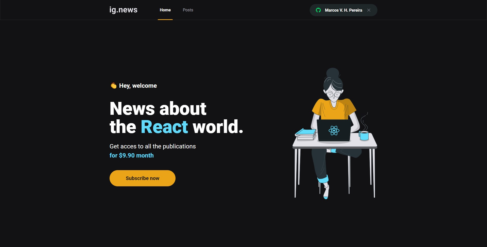

<h2 align="center">
  
</h2>

<p align="center">
  <a href="#dart-sobre">Sobre</a> &#xa0; | &#xa0;
  <a href="#rocket-tecnologias">Tecnologias</a> &#xa0; | &#xa0;
  <a href="#white_check_mark-configuracoes">Requerimentos</a> &#xa0; | &#xa0;
  <a href="#checkered_flag-começando">Começando</a> &#xa0; &#xa0; | &#xa0;
</p>


# 🎯 Sobre o projeto


O projeto tem como objetivo o estudo e desenvolvimento de uma aplicação em ReactJS com NextJS para listagem de posts e sistema de inscrição.

A aplicação foi desenvolvida utilizando o framework NextJS aplicando conceitos como:

  - Consumo de API externas
  - API Root
  - Server Side Rendering (SSR)
  - Static Site Generation (SSG)
  - STRIPE para pagamentos das inscrições
  - NextAuth para autenticação com Github
  - FaunaDB
  <!-- Prismic ainda não -->
  <!-- - Prismic CMS para adição e gerenciamento do conteúdo dos posts. -->


O projeto foi desenvolvido como pratica das aulas do modulo 03 do Ignite da Rocketseat.

---

# 📺 Preview
<div>
   
</div>

---

# 🚀 Tecnologias

- [Next.js](https://nextjs.org/)
- [Stripe](https://stripe.com/)
- [FaunaDB](https://fauna.com/)
- [TypeScript](https://www.typescriptlang.org/)
- [Next-Auth](https://next-auth.js.org/)
- [SASS](https://sass-lang.com/)
<!-- - [Prismic CMS](https://prismic.io/) -->

---

# ✅ Configurações necessárias

## 💾 Instalar:

- Yarn
- Stripe CLI

Criar conta e configurar os serviços externos:

- Stripe
- FaunaDB
- Prismic CMS

## ✍ Clone do projeto

```bash
# Execute o comando git clone para realizar o clone do repositório
$ git clone https://github.com/marcos-hein/ignews.git
# Entre na pasta do repositório clonado
$ cd ignews
```
## 🏁 Iniciando o projeto

```bash
# Execute yarn para instalar as dependências
$ yarn

# Na raiz do projeto crie uma copia do arquivo .env.local.example
# Altere o nome da copia para .env.local
# Preencha as variáveis ambiente de acordo com as instruções
$ cp .env.local.example .env.local

# Execute stripe listen para ouvir eventos do webhook
$ stripe listen --forward-to localhost:3000/api/webhooks

# Para iniciar a aplicação
$ yarn dev
```
